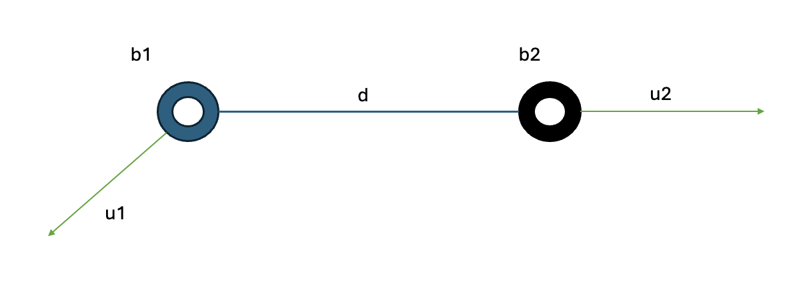
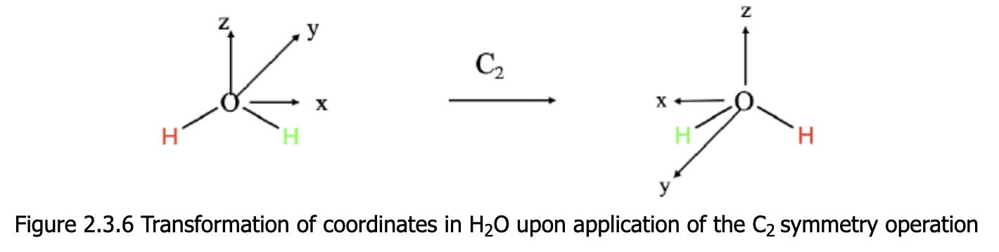
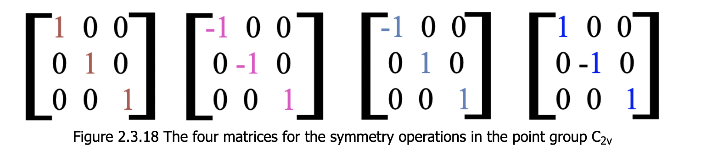

# Overlap Integral Calculation for Normal Modes

## Some General Definitions

**3D Gaussian Function**

Given by 

$f_i(r) = a_i \exp\left(-\frac{(r-b_i)^T(r-b_i)}{2c_i^2}\right)$

where:

- $a_i$ is the amplitude,
- $b_i$ is the center,
- $c_i$ is the width.

**Gaussian Product Theorem**

The Gaussian Product Theorem tells us that the product of two gaussian functions is again a Gaussian functions. For simplicity we assume that the two gaussians we want to multiply are 1-dimenional:
ls
+ $f_1(x) = a_1 \exp\left(-\frac{(x-b_1)^2}{2c_1^2}\right)$
+ $f_2(x) = a_2 \exp\left(-\frac{(x-b_2)^2}{2c_2^2}\right)$

If we compute the product we obtain:

$$f_1(x) f_2(x) = a_1 a_2 \exp\left(-\frac{(x-b_1)^2}{2c_1^2} - \frac{(x-b_2)^2}{2c_2^2}\right)$$

we first take a look at the exponent:

$$-\frac{(x-b_1)^2}{2c_1^2} - \frac{(x-b_2)^2}{2c_2^2}$$

+ $(x-b_1)^2 = x^2 - 2b_1x + b_1^2$
+ $(x-b_2)^2 = x^2 - 2b_2x + b_2^2$

this gives us:

$$ - \frac{x^2 - 2b_1x + b_1^2}{2c_1^2} - \frac{x^2 - 2b_2x + b_2^2}{2c_2^2}$$

we combine the terms:

$$-\left(\frac{1}{2c_1^2} + \frac{1}{2c_2^2}\right)x^2 + \left(\frac{b_1}{c_1^2} + \frac{b_2}{c_2^2}\right)x - \left(\frac{b_1^2}{2c_1^2} + \frac{b_2^2}{2c_2^2}\right)$$

We want to complete the square, thus first define:

+ $ \alpha = \frac{1}{2c_1^2} + \frac{1}{2c_2^2}$
+ $\beta = \frac{b_1}{c_1^2} + \frac{b_2}{c_2^2}$
+ $\gamma = \frac{b_1^2}{2c_1^2} + \frac{b_2^2}{2c_2^2}$

which leads us to $-\alpha x^2 + \beta x - \gamma$. If we now complete the square we get:

$$-\alpha x^2 + \beta x = -\alpha \left(x^2 - \frac{\beta}{\alpha} x\right) = -\alpha \left(x - \frac{\beta}{2\alpha}\right)^2 + \frac{\beta^2}{4\alpha}$$

this leads us to the following exponent:

$$-\alpha \left(x - \frac{\beta}{2\alpha}\right)^2 + \frac{\beta^2}{4\alpha} - \gamma$$

again we get a Gaussian function this time with new parameters:

+ $a' = a_1 a_2 \exp\left(\frac{\beta^2}{4\alpha} - \gamma\right)$
+ $b' = \frac{\beta}{2\alpha} = \frac{b_1 c_2^2 + b_2 c_1^2}{c_1^2 + c_2^2}$
+ $\frac{1}{2c'^2} = \alpha = \frac{1}{2c_1^2} + \frac{1}{2c_2^2} = \frac{c_1^2 + c_2^2}{2c_1^2 c_2^2} \Leftrightarrow c' ={\frac{c_1 c_2}{\sqrt{c_1^2 + c_2^2}}}$

in a rather tedious equation we can also simplify the amplitude $a'$ to:

$$a' = a_1a_2 \exp\left(\frac{-(b_1 - b_2)^2}{2(c_1^2 + c_2^2)}\right)$$

**Overlap Integral**

As $r=(x,y,z)$ is a position vector and $b_i = (b_{ix}, b_{iy}, b_{iz})$ is the center of the Gaussian, the overlap integral is defined as:

$$S= \int_{\mathbb{R}^3} f_i(r) f_j(r) dr = \int_{-\infty}^{+\infty} \int_{-\infty}^{+\infty} \int_{-\infty}^{+\infty} f_i(x,y,z) f_j(x,y,z) dx dy dz$$

We can use the Gaussian Product Theorem and know that the integral of a general Gaussian function is given by $\int_{-\infty}^{\infty} \exp(-\alpha u^2) du = \sqrt{\frac{\pi}{\alpha}}$.

This leads us in the end to the expression:

$$S = a_1 a_2 \left(\frac{2\pi c_1^2 c_2^2}{c_1^2 + c_2^2}\right)^{3/2} \exp\left(-\frac{(b_1 - b_2)^T(b_1 - b_2)}{2(c_1^2 + c_2^2)}\right)$$

**Normalization to the Volume of the VDW Sphere**

In order to determine the parameters $a_i$ for our Gaussian functions we have to normalize the Gaussian function to the volume of the VDW sphere. Mathematically this means:

$$\int_{\mathbb{R}^3} f_i(r) dr = V_{vdw} = \frac{4}{3} \pi r_{vdw}^3$$

This leads us after some tedious calculations to the expression:

$$a_i = \frac{r^3_{vdw}}{3\sqrt{2\pi} c_i^3}$$

As we model the Gaussian Sphere at the moment we take $c_i = r_{vdw}$, which leads to:

$$a_i = \frac{r^3_{vdw}}{3\sqrt{2\pi} r_{vdw}^3} = \frac{1}{3\sqrt{2\pi}}$$

## Determining the Volume Change 

For this we first perform a initial test we consider the following simple model:

> Two atoms $H_1-H_2$ where $H_1$ is centered at the origin $b_1=(0,0,0)$ and $H_2$ is centered at $b_2=(1.0,0,0)$, the VDW radius of $H$ is $r_{vdw}= 1.2$ what we to is that we displace the atom $H_2$ by a vector $u_2 = (0.5,0,0)$ and calculate the change in the overlap integral.

Again the overlap integral is given by:

$$S = a_1 a_2 \left(\frac{2\pi c_1^2 c_2^2}{c_1^2 + c_2^2}\right)^{3/2} \exp\left(-\frac{(b_1 - b_2)^T(b_1 - b_2)}{2(c_1^2 + c_2^2)}\right)$$

first we calculate the gradient in the $u_2$ direction, we set $b_2' = b_2 + u_2$

$$S(u_2) = a_1 a_2 \left(\frac{2\pi r_{vdw}^4}{2r_{vdw}^2}\right)^{3/2} \exp\left(-\frac{(b_1 - b_2 + u_2)^T(b_1 - b_2 + u_2)}{2(c_1^2 + c_2^2)}\right)$$

The gradient is given by 

$$ \nabla_{u_2} S = \left( \frac{\partial S}{\partial u_{2x}}, \frac{\partial S}{\partial u_{2y}}, \frac{\partial S}{\partial u_{2z}} \right)$$

we define:

+ $K = a_1 a_2 \left(\frac{2\pi r_{vdw}^4}{2r_{vdw}^2}\right)^{3/2}$
+ $E(u_2) = \left(-\frac{||b_1 - (b_2 + u_2)||^2}{2(c_1^2 + c_2^2)}\right)$

which gives us $S(u_2) = K \cdot e^{E(u_2)}$

now with the chain rule $\nabla_{u_2} S =  K \cdot e^{E(u_2)} \nabla_{u_2} E(u_2)$. 

**Computation of the Gradient $\nabla_{u_2} E(u_2)$**

We define $r = b_1 - b_2 - u_2$, then we have:

$$E(u_2) = -\frac{r^T r}{2(c_1^2 + c_2^2)}$$

the gradient is given by:

$$\nabla_{u_2} E(u_2) = \frac{\partial}{\partial u_2}\left(-\frac{r^T r}{2(c_1^2 + c_2^2)}\right)$$

this gives us $\frac{\partial r}{\partial u_2} = -I$ and:

$$\nabla_{u_2} E(u_2) = -\frac{1}{2(c_1^2 + c_2^2)} \cdot 2r^T (-I) = \frac{r^T}{c_1^2 + c_2^2}$$

which gives us the final gradient:

$$\nabla_{u_2} S = S \cdot \frac{b_1 - b_2 - u_2}{c_1^2 + c_2^2}$$

### Computation of Change after Displacments

The change in the overlap after a displacment of atoms in a molecule is given by:

$$\Delta S = S(b_1 + u_1, b_2 + u_2) - S(b_1, b_2)$$

this can be of course be computed pairwise for all the atoms in the molecule. For this we can use the binomial coefficient, to determine the number of pairs where we can compute this change:

$$\binom{n}{2} = \frac{n!}{2!(n-2)!} = \frac{n(n-1)}{2}$$

where $n$ is the number of atoms in the molecule.

### Gradient of Overlap of two displaced atoms

> For this example we can consider the figure below, where we have two atoms located at $b_1$ and $b_2$ with a arbitrary $r_{vdw}$ We now want to displace these two atoms by both the vectors $u_1$ and $u_2$ respectively.

After application of the displacement we can write the overlap integral as:

$$S(u_1,u_2) = a_1 a_2 \left(\frac{2\pi c_1^2 c_2^2}{c_1^2 + c_2^2}\right)^{3/2} \exp\left(-\frac{||(b_1+u_1)  - (b_2 + u_2)||}{2(c_1^2 + c_2^2)}\right)$$

Let $r=(b_1 + u_1) - (b_2 + u_2)$ then the gradient of $S$ with respect to $u_1$ and $u_2$ is given by:

$$\nabla_{u_1} S = \frac{S}{c_1^2 + c_2^2} \cdot r \quad \nabla_{u_2} S = \frac{S}{c_1^2 + c_2^2} \cdot (-r)$$

# Symmetry Detection in Molecules

> Next we detect the point group of a molecule. For this we use the `pymatgen`library. Each point group can be represented as a set of orthogonal matrices $M$ that transform a point $x$ into a point $y=Mx$. Each element of a point group is either a rotation $det=1$ or a reflection or improper rotation $det=-1$.

This process can be visualized for example at a water molecule, here if we define a coordinate system we can apply a matrix that represents $C_2$ rotation

We can summarize this for the $C_{2v}$ point group and obtain the following matrices:

Note that the sum of the diagonal is the trace of the matrix, this trace tells us exactly what a symmetry operation does with a coordinate. If it is a $-1$ the sign of the coordinate is flipped if it is $+1$ is stays unchanged.

+ The sum of two or more irreducible representations gives as a so called reducible representation

What I mainly use here is to detect the symmetry planes inside a molecule and subsequently determine vibrations that displace atoms out of these symmetry planes. We can first extract all reflections out of our symmetry operations using the condition $det(M) = -1$.

**Reflection across a line in the plane**

Reflection across an arbitrary line through the origin in two dimensions can be described by the following formula:

$$Ref_l(v) = 2 \frac{v \cdot l }{l \cdot l} l - v$$

where $l$ is the line through the origin and $v$ is the vector we want to reflect.

After the displacements we get new centers $b_1' = b_1 + u_1$ and $b_2' = b_2 + u_2$ we can insert this into the overlap integral:

$$S(b_1',b_2') = a_1 a_2 \left(\frac{2\pi c_1^2 c_2^2}{c_1^2 + c_2^2}\right)^{3/2} \exp\left(-\frac{(b_1' - b_2')^T(b_1' - b_2')}{2(c_1^2 + c_2^2)}\right)$$

$$S(b_1 + u_1, b_2 + u_2) = a_1 a_2 \left(\frac{2\pi r_{vdw}^4}{2r_{vdw}^2}\right)^{3/2} \exp\left(-\frac{(b_1 - b_2 + u_1 - u_2)^T(b_1 - b_2 + u_1 - u_2)}{2(c_1^2 + c_2^2)}\right)$$

To simplify this we denote $S_0 = a_1a_2 \left(\frac{2\pi r_{vdw}^4}{2r_{vdw}^2}\right)^{3/2}$

$$S(b_1 + u_1, b_2 + u_2) = S_0 \exp\left(-\frac{(b_1 - b_2 + u_1 - u_2)^T(b_1 - b_2 + u_1 - u_2)}{2(c_1^2 +c_2^2)}\right)$$

### Directional Derivative

We now want a formula to estimate the rate at which our overlap integral changes in a particular direction. This is given by the directional derivative, Because our function is differentiable anyways, we can write the directional derivative as:

$$\nabla_v f(x) = \nabla f(x) \cdot v$$

where $v$ is the direction in which we want to calculate the derivative

### Calculation of the Gradient

Define $r = b_1 - b_2 + u_1 - u_2$ then our overlap integral can be written as:

$$S(b_1 + u_1, b_2 + u_2) = S_0 \exp\left(-\frac{r^Tr}{2(c_1^2+c_2^2)}\right)$$

**Gradient $\nabla_{u_1}S$**

$$\nabla_{u_1}S = S_0 \exp\left(-\frac{r^Tr}{2(c_1^2+c_2^2)}\right) \cdot \nabla_{u_1}\left(-\frac{r^Tr}{2(c_1^2+c_2^2)}\right)$$

Where we can now use $\nabla_{u_1}r = \nabla_{u_1}(b_1 - b_2 + u_1 - u_2) = e_1$ (the unit vector in the direction of $u_1$), which implies $\nabla r = 2r$

$$\nabla_{u_1}S = S\cdot(-\frac{2r}{2(c_1^2+c_2^2)}) = -\frac{Sr}{c_1^2 + c_2^2}$$

**Gradient $\nabla_{u_2}S$**

Here we get exactly the same result but with a different sign:

$$\nabla_{u_2}S = S\cdot(-\frac{2r}{2(c_1^2+c_2^2)}) = \frac{Sr}{c_1^2 + c_2^2}$$

Already for this simple model this gives us a approximation of the change in the overlap we have to calculate, for small displacments

$$\Delta S \approx \nabla_{u_1}S + \nabla_{u_2}S$$

### Volume Change of Two Moving Atoms

The next test includes displacement of two atoms at the same time.

> Consider two atoms $H_1$ and $H_2$ with centers $b_1$ and $b_2$ distanced by $d = ||b_1 - b_2||$. Again the Vdw radius is $r_{vdw} = 1.2$ we want to calculate the change in the overlap integral if we displace both atoms by some vectors $u_1$ and $u_2$.

Starting again with the overlap integral:

$$ S = a_1 a_2 \left(\frac{2\pi c_1^2 c_2^2}{c_1^2 + c_2^2}\right)^{3/2} \exp\left(-\frac{(b_1 - b_2)^T(b_1 - b_2)}{2(c_1^2 + c_2^2)}\right)$$

+ New position of $H_1: b_1' = b_1 + u_1$
+ New position of $H_2: b_2' = b_2 + u_2$

The overlap integral after the displacements is given by:

$$ S(b_1', b_2') = a_1 a_2 \left(\frac{2\pi c_1^2 c_2^2}{c_1^2 + c_2^2}\right)^{3/2} \exp\left(-\frac{||b_1 + u_1 - b_2 - u_2 ||^2}{2(c_1^2 + c_2^2)}\right)$$

Clearly we can calculate the change in overlap integral by calculating the difference:

$$ \Delta S = S(b_1 + u_1, b_2 + u_2) - S(b_1, b_2)$$

We can of course also calculate the gradient similar to the previous example this means:

$$\nabla_{u_1} S = \frac{\partial S}{\partial u_1}, \nabla_{u_2} S = \frac{\partial S}{\partial u_2}$$

with the chain rule as before we get:

$$\nabla_{u_1} S = S \cdot \frac{b_2 + u_2 - b_1 - u_1}{c_1^2 + c_2^2}$$

$$\nabla_{u_2} S = S \cdot \frac{b_1 + u_1 - b_2 - u_2}{c_1^2 + c_2^2}$$

# Calculate change with Argon, Neon atoms!!!

